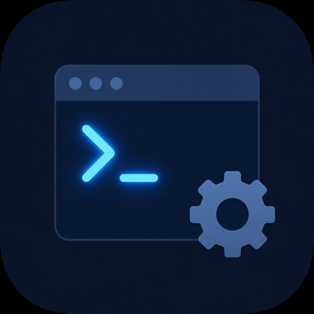

<p align="center">
  
</p>

<h1 align="center">macos-terminal-mcp</h1>

<p align="center">
  <a href="https://www.npmjs.com/package/@priyanshumit/macos-terminal-mcp"></a>
  <a href="https://github.com/priyanshumit/macos-terminal-mcp/actions/workflows/ci.yml"></a>
  <a href="./LICENSE"></a>
</p>

A local MCP server that lets AI agents inspect and drive your macOS Terminal.app tabs — list windows, read scrollback, execute commands, and clear buffers, all gated by a three-tier safety model plus per-call user confirmation for any write operation.

## What it does

Fifteen MCP tools across four categories:

### Terminal interaction

| Tool | Read/Write | Description |
|---|---|---|
| `terminal_list` | read | Enumerate every open Terminal.app tab with tty, title, busy state, and foreground processes. |
| `terminal_read` | read | Return the full buffer + scrollback of a specific tab, identified by tty. |
| `terminal_execute` | **write** | Type a command into a specific tab and press Enter. Refuses if the target tab is busy unless `force=true`. `dry_run=true` returns the safety verdict without any side effects. |
| `terminal_clear` | **write** | Wipe scrollback of a specific tab via Cmd+K. Briefly steals focus. |
| `terminal_new_tab` | **write** | Open a new empty tab in Terminal.app and return its tty for follow-up calls. No dialog — low blast radius (user can close the tab). |
| `terminal_close_tab` | **write** | Close a specific tab by tty. Refuses busy tabs unless `force=true`. No dialog. |
| `terminal_wait_for_idle` | read | Block until the target tab is no longer busy, or until `timeout_seconds` (default 60, max 600). Polls every 250ms inside a single JXA call. |

### Safety policy management

| Tool | Read/Write | Description |
|---|---|---|
| `safety_list` | read | Show all current safety patterns with their levels. |
| `safety_add` | **write** | Propose a new pattern + level; user approves via dialog before persisting. |
| `safety_remove` | **write** | Drop a pattern. Warns prominently in the dialog if the pattern is `forbidden`. |
| `safety_set_level` | **write** | Change the level of an existing pattern. Warns when downgrading from `forbidden`. |

### Async approval queue

| Tool | Read/Write | Description |
|---|---|---|
| `pending_list` | read | Snapshot of commands currently awaiting approval. |
| `pending_approve` | **write** | Approve a queued command by id. Triggers its own confirmation dialog. |
| `pending_deny` | **write** | Deny a queued command. |

### Observability

| Tool | Read/Write | Description |
|---|---|---|
| `audit_log_tail` | read | Read the last N entries from the audit log. Default count 20, max 1000. Returns parsed JSON array of `{timestamp, tool, outcome, ...}` entries. |

Write tools are **off by default**. Set `WRITE_TOOLS_ENABLED=1` in the server's environment to enable them. Even when enabled, every non-`safe` operation triggers a native macOS confirmation dialog.

## Prerequisites

- macOS (uses JXA / `osascript`)
- Node ≥ 20
- Terminal.app (the stock macOS terminal)

## Install

### Option A: via npm (recommended)

Once published:

```bash
# Run directly without installing
npx -y @priyanshumit/macos-terminal-mcp

# Or install globally
npm install -g @priyanshumit/macos-terminal-mcp
```

### Option B: from source

```bash
git clone https://github.com/priyanshumit/macos-terminal-mcp.git
cd macos-terminal-mcp
npm install
npm run build
```

## macOS permissions

First time the MCP server controls Terminal.app, macOS will prompt for permission:

> *"node" wants access to control "Terminal".*

Click **OK**. The setting is remembered in **System Settings → Privacy & Security → Automation**.

`terminal_clear` additionally requires **Accessibility** permission (it uses System Events to simulate Cmd+K). Grant under **System Settings → Privacy & Security → Accessibility**.

## Scrollback configuration

For `terminal_read` to return meaningful history, set Terminal.app's scrollback to a generous size:

**Terminal.app → Settings → Profiles → (your profile) → Window → Scrollback**: set to **Unlimited** or a large fixed number.

## Register with Claude Code

```bash
claude mcp add macos-terminal --command=npx --args=-y --args=@priyanshumit/macos-terminal-mcp
```

Or add to `~/.claude.json` / project `.mcp.json` manually:

```json
{
  "mcpServers": {
    "macos-terminal": {
      "command": "npx",
      "args": ["-y", "@priyanshumit/macos-terminal-mcp"]
    }
  }
}
```

To enable write tools, add the env block:

```json
{
  "mcpServers": {
    "macos-terminal": {
      "command": "npx",
      "args": ["-y", "@priyanshumit/macos-terminal-mcp"],
      "env": { "WRITE_TOOLS_ENABLED": "1" }
    }
  }
}
```

Restart Claude Code. You should see the eleven tools listed.

## Three-tier safety model

Every `terminal_execute` call is evaluated against a list of regex patterns, each tagged with a level:

| Level | Behavior |
|---|---|
| `safe` | Auto-run, no confirmation |
| `requires_approval` | Native confirmation dialog (also enqueued for async approval via `pending_*`) |
| `forbidden` | **Refused outright** — no dialog can approve it. To run a forbidden command, do it yourself in a real terminal. |

**Evaluation rule: highest-restriction wins.** If a command matches both a `safe` pattern and a `forbidden` pattern, it's forbidden. This blocks composite-command bypasses like `ls && rm -rf /tmp/x` — the safe `^ls` match doesn't shield the forbidden `\brm\s+-rf?\b` match.

**Default if no pattern matches**: `requires_approval`. New/unknown commands always confirm.

## Default forbidden patterns

| Pattern | Why |
|---|---|
| `\brm\s+-rf?\b` | Recursive delete |
| `\bsudo\b` | Privilege escalation — humans only |
| `\|\s*(bash\|sh\|zsh)\b` | Pipe-to-shell — common attack vector |
| `\bcurl\b[^\|;]*\|`, `\bwget\b[^\|;]*\|` | Curl/wget piped to anything |
| `>\s*/etc/`, `>\s*/dev/` | Writing to /etc or /dev |
| `/etc/passwd`, `/etc/shadow`, `~/.ssh` | System or credential files |
| `\bdd\s+if=` | dd — can overwrite disks |
| `\bgit\s+push\s+(--force\|-f)\b` | Force push |
| `\bgit\s+reset\s+--hard\b` | Discards local work |
| `\bgit\s+clean\s+-[fdx]+\b` | Destructive git clean |
| `\bshutdown\b`, `\breboot\b`, `\bkillall\b` | System control |
| `:\(\)\{:\|:&\};:` | Fork bomb |

The full list is in `src/safety/patterns.ts`. Customize via `safety_*` tools or by editing `~/.config/macos-terminal-mcp/safety.json` directly.

## Customizing patterns

**From within Claude:**

> *"Add `^cargo build` as a safe pattern."* → Claude calls `safety_add({pattern: "^cargo build", level: "safe"})` → you click Allow on the dialog → it's persisted.

> *"Show me the current safety policy."* → `safety_list` returns the JSON.

> *"Forbidden `^docker\\s+rm`."* → Claude calls `safety_add({pattern: "^docker\\s+rm", level: "forbidden"})` → dialog → persisted.

**By editing the file:**

`~/.config/macos-terminal-mcp/safety.json`:

```json
{
  "patterns": [
    { "pattern": "^cargo build\\b", "level": "safe", "description": "Rust builds" },
    { "pattern": "\\bmy-deploy-script\\b", "level": "forbidden", "description": "Never deploy from AI" }
  ]
}
```

If the file has the v1 schema (`{"allowlist": [...], "denylist": [...]}`), it's automatically migrated on load.

## Async approval queue

When `terminal_execute` triggers `requires_approval`, two things happen in parallel:
1. A native macOS dialog pops asking you to Allow/Deny.
2. The command is enqueued — visible via `pending_list`, resolvable via `pending_approve(id)` / `pending_deny(id, reason)`.

Whichever path resolves first wins. For solo desktop use, the dialog is the canonical signal. For headless/remote/team contexts, the queue tools provide an out-of-band approval path.

Pending entries auto-expire after 10 minutes. The queue is in-memory only — a server restart drops all pending entries.

## Privacy & data

**No network, no telemetry.** The server speaks MCP over stdio to your local Claude client. It makes zero outbound network calls — no analytics, no crash reporting, no auto-update pings.

**What is stored on disk:**

| File | Path | Contents | Permissions |
|---|---|---|---|
| Audit log | `~/.local/state/macos-terminal-mcp/audit.log` | One JSON line per write-tool call: tool name, tty, **full command text**, safety level, matched pattern, outcome, timestamp | `0o600` (owner read/write only); parent dir `0o700` |
| Safety config | `~/.config/macos-terminal-mcp/safety.json` | User-added regex patterns with their levels and descriptions | default umask |

**Important caveat for secrets handling**: `terminal_execute` writes the **full command text** to the audit log. If a command contains a password, API key, or other secret, that secret ends up on disk in plaintext (owner-readable only). Mitigations:

- Delete the log at any time: `rm ~/.local/state/macos-terminal-mcp/audit.log`
- Default forbidden patterns already block common secret-leak vectors (`>\s*/etc/`, `\bcurl\b[^|;]*\|`, `\|\s*(bash|sh|zsh)\b`, `~/.ssh`, `/etc/passwd`, `/etc/shadow`)
- Add your own forbidden patterns for company-specific secret formats via `safety_add`

**Where the audit log helps**: post-hoc review of what an AI agent ran on your machine, debugging unexpected command refusals, and satisfying audit requirements in regulated environments.

## Usage examples

Once registered, from Claude Code:

- *"List my open terminals."* → `terminal_list`
- *"What's the last 50 lines from /dev/ttys062?"* → `terminal_read({tty: "/dev/ttys062", lines: 50})`
- *"Run `git status` in /dev/ttys054."* → `terminal_execute` (auto-runs, safe pattern)
- *"Run `rm -rf /tmp/cache` in /dev/ttys054."* → **refused** (matches forbidden pattern)
- *"Run `cargo test` in /dev/ttys054."* → dialog pops (no safe pattern matches, default requires_approval)
- *"Show me what's in the approval queue."* → `pending_list`
- *"Approve queued command abc-123."* → `pending_approve({id: "abc-123"})` — also pops a dialog

## Troubleshooting

**"osascript exited 1: ... not authorized"**
Automation permission has not been granted. Open System Settings → Privacy & Security → Automation, find the process, allow it to control Terminal.

**Confirmation dialogs never appear**
The MCP server is in a context without a GUI session. Test:
```bash
osascript -l JavaScript -e 'Application.currentApplication().includeStandardAdditions = true; Application.currentApplication().displayDialog("test")'
```

**`terminal_clear` does nothing**
Requires Accessibility permission, and the target window must accept keyboard focus. If you have multiple Terminal windows, focus may not settle on the intended one before the keystroke fires. Run `terminal_list` first to confirm the tty.

**`terminal_read` returns less than expected**
Terminal.app's scrollback cap is profile-controlled. Increase under Terminal.app → Settings → Profiles → Window → Scrollback.

**Command refused as "forbidden" but I have a legit reason**
Forbidden patterns intentionally cannot be approved via the tool. Either run the command yourself in a real terminal, or use `safety_set_level({pattern: "...", level: "requires_approval"})` to downgrade — you'll see a downgrade warning in the confirmation dialog.

## License

MIT — see [LICENSE](./LICENSE).
